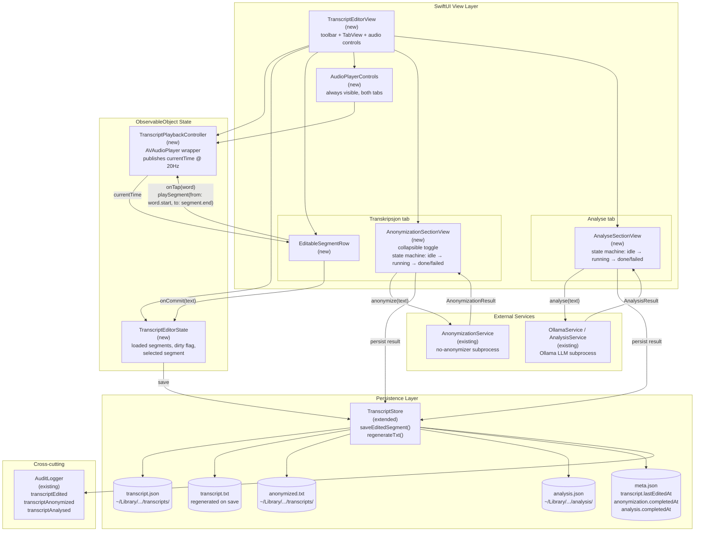
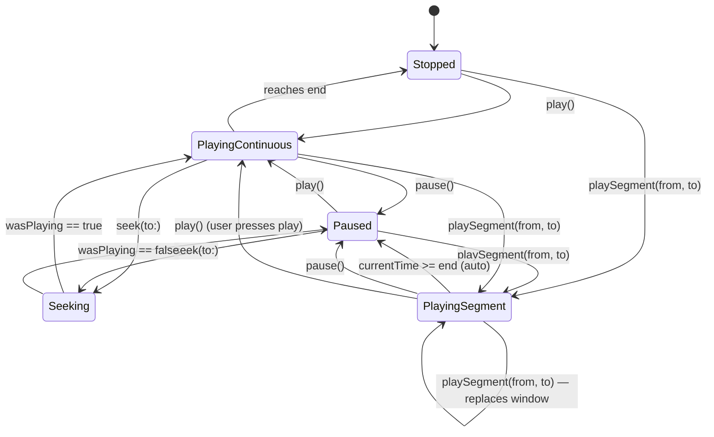
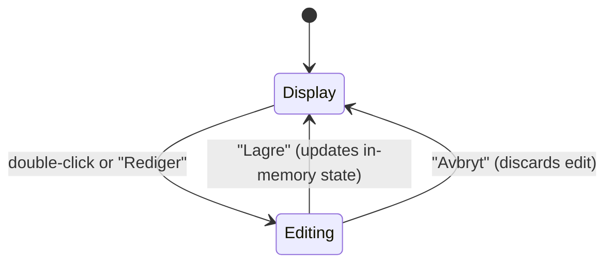
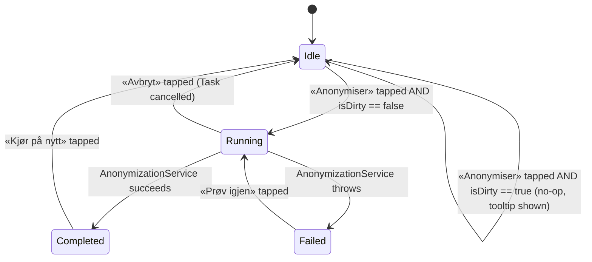
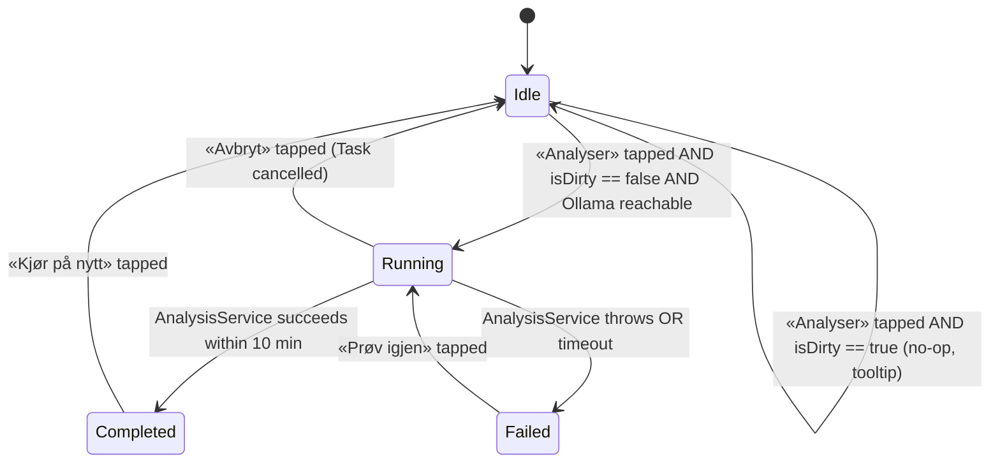

# Transcript Editor — Implementation Guide

**Epic:** Transcription
**User stories:**
- [US-T11](USER_STORIES.md#us-t11) — Rett transkripsjonsfeil mens jeg lytter til opptaket (editing + playback)
- [US-T12](USER_STORIES.md#us-t12) — Anonymiser transkripsjon fra editoren (anonymization section)
- [US-T7](USER_STORIES.md#us-t7-run-llm-analysis-on-transcript) — Analyser transkripsjon (LLM analysis section, moved here from recording detail view)

**Status:** Draft — ready for implementation
**Date:** 2026-04-17
**Related:** [US-FM-09 Upload story](../file-management-teams-sync/USER_STORIES.md) (this editor is a prerequisite for the upload flow — researchers edit before upload, per the workflow agreed 2026-04-17)

---

## Purpose of this document

This document gives an implementing agent everything needed to build the transcript editor feature end-to-end without re-deriving decisions from scratch. It is deliberately prescriptive about *what* to build and *why*, but stays out of Swift syntax — the agent is expected to follow existing codebase patterns.

Read [CLAUDE.md](../../../CLAUDE.md) first if you haven't. This document assumes familiarity with the project's Norwegian-in-UI rule, the Design token system (`AppColors`, `AppSpacing`, `AppRadius`), and the rule against writing to the Desktop from new code.

---

## Why this feature exists

NB-Whisper produces good transcriptions for Norwegian but gets words wrong — dialect variations, domain-specific terms, overlapping speech, poor audio segments. Today researchers have no way to fix these errors inside ARM. They either:

1. Live with the errors.
2. Export to `.txt` and edit elsewhere, losing timestamps and speaker labels.
3. Re-record — not viable for interview material.

The editor fixes this by letting researchers listen and edit simultaneously, with the current-spoken word highlighted, so spotting and fixing errors becomes a fast review pass rather than a second transcription pass.

This is also a **prerequisite for the upload workflow** agreed 2026-04-17: researchers edit → anonymize → double-check → upload. Without in-app editing, researchers would upload raw NB-Whisper output and fix errors downstream in Word, which breaks the compliance posture of "all sensitive processing happens on the insight machine before egress."

---

## Scope

### In scope (this feature)

- Loading an existing transcript from the canonical JSON file
- Audio playback synchronized with a visual highlight of the currently-spoken word
- Click-to-play-segment: single-clicking anywhere on a segment row plays **only that segment** (from the segment start, or from the word's timestamp if a specific word was clicked), then auto-pauses at the segment boundary. The entire row is hit-testable, not just the timestamp gutter
- Double-click anywhere on the row (including on a word) enters edit mode for that segment — same behaviour as pressing the row's «Rediger» button
- Segment-level text editing (the whole segment's text is an editable field)
- Persisting edits to the canonical JSON
- Regenerating the `.txt` export from the edited JSON
- Emitting `transcriptEdited` audit events
- A "dirty" indicator for unsaved changes
- **Linked recording button** in the toolbar: shows the name of the audio file tied to this transcript and navigates to it in the recording list when clicked (see US-T11)
- **Two tabs** at the top of the content area (below the main toolbar): **Transkripsjon** and **Analyse**
- **Transkripsjon tab**: the segment editor (karaoke + editing) plus a collapsible **Anonymisering panel** controlled by a toggle in the panel header
- **Anonymisering panel toggle**: expands or collapses the full anonymization state machine within the Transkripsjon tab; collapsed by default so the segment list gets maximum space; remembers its last state per session
- **Analyse tab**: dedicated full-surface view for the LLM analysis state machine — completely separate from the editing surface (see US-T7; moved here from the recording detail view)
- **Audio controls** remain docked at the bottom and are visible on both tabs, so researchers can listen while reviewing analysis output

### Out of scope (deferred)

- **Word-level timestamp re-alignment** on edits. Segment boundaries stay anchored to the audio; words within an edited segment share that boundary. This is a deliberate trade-off — see [Design decisions](#design-decisions).
- **Splitting or merging segments.** NB-Whisper sometimes glues or splits badly, but adding split/merge adds real UX complexity. Defer until researchers complain.
- **Revert-to-original per segment.** Requires preserving the original NB-Whisper text alongside the edited version. Cheap to add later (additive schema change) — see [Open questions](#open-questions).
- **Editing the anonymized variant.** Same editor pattern applies but scoped to a separate story (US-T13). Build the anonymization section components so a future anonymized-variant editor can reuse them.

---

## Architecture overview



### Why this shape

Three clearly separated concerns:

- **View layer** is dumb. Renders what state tells it, forwards gestures to state.
- **State layer** (`TranscriptPlaybackController` + `TranscriptEditorState`) holds all time and edit state. The playback controller owns `AVAudioPlayer`; the editor state owns the in-memory segment list and dirty tracking.
- **Storage layer** is the single point where JSON, TXT, sidecar, and audit log all get updated atomically for a save operation.

This follows the same pattern the codebase already uses for `TranscriptionService` (state + subprocess + persistence) and `AudioRecorder` (state + AVFoundation). Don't invent a new pattern.

---

## Component responsibilities

### `TranscriptEditorView` (new)

Lives at `Sources/AudioRecordingManager/TranscriptEditorView.swift`.

Top-level editor view. Takes a recording identifier, loads the transcript, wires up the playback controller and editor state, and renders:

```
┌──────────────────────────────────────────────┐
│ toolbar: [Vis opptak]   [● Ulagrede]  [Lagre]│
├──────────────────────────────────────────────┤
│  [ Transkripsjon ]  [ Analyse ]              │  ← tab bar
├──────────────────────────────────────────────┤
│                                              │
│  Transkripsjon tab:                          │
│  ┌─────────────────────────────────────┐    │
│  │ ▶ Anonymisering          [toggle]   │    │  ← collapsible header
│  │   (expanded: state machine UI)      │    │
│  └─────────────────────────────────────┘    │
│                                              │
│  segment list (karaoke / edit)               │
│                                              │
│  Analyse tab:                                │
│  (full-surface AnalyseSectionView)           │
│                                              │
├──────────────────────────────────────────────┤
│  audio controls  ◀◀  ▶  ————●————  0:42/12:34│  ← always visible
└──────────────────────────────────────────────┘
```

Responsibilities:
- Load transcript JSON via `TranscriptStore.loadTranscript(for:)`
- Load the audio file URL from the recording folder
- Instantiate `TranscriptPlaybackController(audioURL:)`
- Instantiate `TranscriptEditorState(result:)`
- Own the active tab selection as `@State private var selectedTab: EditorTab` (`.transkripsjon` | `.analyse`)
- Render `AnonymizationSectionView` inside the Transkripsjon tab, with a `@State private var anonymizationExpanded: Bool = false` toggle controlling its visibility
- Render `AnalyseSectionView` as the full content of the Analyse tab
- Render `AudioPlayerControls` outside the `TabView`, docked at the bottom — always visible regardless of active tab
- Auto-scroll the currently-playing segment into view when it changes (use `ScrollViewReader` inside the Transkripsjon tab only)
- Show a confirmation sheet if the user tries to navigate away with unsaved changes
- Accept an optional `onShowLinkedRecording: (() -> Void)?` callback from the parent for the linked recording button; own all other state locally

### `TranscriptPlaybackController` (new)

Lives at `Sources/AudioRecordingManager/Playback/TranscriptPlaybackController.swift`. (Create the `Playback/` directory — this will grow.)

An `ObservableObject` wrapping `AVAudioPlayer`. Publishes:

- `@Published var currentTime: Double` — updated ~20 Hz by a `Timer` on the main run loop while playing, matches the sampling rate of the existing waveform visualization (see `AudioLevelVisualization.swift:*` for precedent).
- `@Published var isPlaying: Bool`
- `@Published var duration: Double`
- `@Published var playbackRate: Float` (0.5×, 0.75×, 1×, 1.25×, 1.5×, 2×)
- `@Published var playbackMode: PlaybackMode` — either `.continuous` (normal play-through from current position) or `.segment(end: Double)` (play until `end`, then auto-pause). This is how click-to-play-segment is implemented without a separate playback subsystem.

Methods:
- `play()` — continuous playback from the current position
- `pause()`, `toggle()`, `setRate(_ rate: Float)`
- `seek(to time: Double)` — move the playhead without changing `playbackMode`; used by the scrubber
- `playSegment(from start: Double, to end: Double)` — seek to `start`, set `playbackMode = .segment(end:)`, and play. The 20 Hz timer checks `currentTime >= end` and calls `pause()` at the boundary (then resets `playbackMode` to `.continuous` so the next `play()` behaves normally).

Threading: `AVAudioPlayer` is safe to call from the main thread. The timer runs on the main run loop. Stop the timer in `pause()` and on deinit to avoid leaks.

Why `playSegment` lives on the controller, not in the view: the auto-pause check has to happen on every timer tick, not only on currentTime-publish callbacks from the view. Keep the boundary-check logic adjacent to the timer that drives it.

### `EditableSegmentRow` (new)

Lives at `Sources/AudioRecordingManager/TranscriptEditorView.swift` (same file as the view, private type) or a sibling file — both are acceptable. Follow whatever pattern is used for `SegmentRow` in `TranscriptionResultView.swift:24`.

Two visual modes:

**Display mode** (default):
- Timestamp + speaker badge on the left (copy pattern from `SegmentRow` in `TranscriptionResultView.swift:24`).
- **The entire row is tappable**: tapping anywhere on the row (timestamp area, whitespace between words, padding around the content) plays the whole segment from `segment.start` to `segment.end`, then auto-pauses at the boundary.
  - **macOS hit-test gotcha:** a single `.onTapGesture` on the outer row container does not reliably capture clicks on `Text` views (the timestamp) or on whitespace inside the word flow, because the word flow uses a custom `Layout` (`WrappingHStack`) that only hit-tests its subviews. Falling-through to a parent's `onTapGesture` is unreliable on macOS. The pattern that works: attach the play+edit gestures to each tap area explicitly — the timestamp `Text`, the wordFlow wrapper (after `.frame(maxWidth: .infinity)` + `.contentShape(Rectangle())`), the outer row as a padding fallback, and each word span — and route them through shared helpers (`schedulePlay`, `enterEditMode`) so behaviour stays consistent.
- Words rendered as individual tappable spans. Each word carries both a `count: 1` tap (plays from `word.start` to `segment.end`) and a `count: 2` tap that enters edit mode for the containing segment. SwiftUI's gesture-priority rules mean the word-level tap takes precedence over the row-level tap when a word is hit.
- The word whose `[start, end)` bracket contains `currentTime` gets a highlight (suggested: subtle background using `AppColors.accent.opacity(0.15)` — **use design tokens, never hardcode**).
- Entering edit mode is triggered by the "Rediger" button, a double-click anywhere on the row, or a double-click on a word — all three call the same internal helper so the behaviour stays consistent.
- **`count: 1` vs `count: 2` trade-off:** SwiftUI on macOS does **not** auto-debounce `count: 1` against `count: 2`. A double-click fires both: `count: 1` on the first click (which calls `playback.playSegment` immediately) and `count: 2` on the pair (which calls `enterEditMode`, which pauses playback). Net effect on double-click is a brief audio blip followed by edit mode with playback paused. This is the deliberate trade-off: single-click feels instant (no debounce delay), and double-click reliably ends in edit mode. An earlier iteration tried a 280 ms `Task`-based debounce so single-click waited for `count: 2` to potentially arrive — but that meant whatever segment was previously playing kept playing during the wait window, and researchers experienced it as "I clicked but the *wrong* segment keeps playing". Immediate play with the blip is the lesser evil.

**Edit mode**:
- The word-span layout is replaced by a `TextEditor` containing the segment's text
- Word-level highlighting falls back to a whole-segment border while editing (acceptable — the researcher is focused on typing, not listening along)
- "Lagre" and "Avbryt" buttons
- On "Lagre", call `editorState.updateSegment(id:text:)` — do **not** call `TranscriptStore` directly from the row

### `TranscriptEditorState` (new)

Lives at `Sources/AudioRecordingManager/TranscriptEditorState.swift`.

An `ObservableObject` holding:
- `@Published var segments: [TranscriptionSegment]` — in-memory working copy
- `@Published var isDirty: Bool` — any unsaved edits
- `@Published var savingInFlight: Bool`
- The recording's UUID and audio URL (for passing back to the store)

Methods:
- `updateSegment(id:text:)` — mutate in-memory segment, set `isDirty = true`
- `save()` async — call `TranscriptStore.saveEditedSegments(...)`, emit audit event, clear `isDirty` on success

### `AnonymizationSectionView` (new)

Lives at `Sources/AudioRecordingManager/AnonymizationSectionView.swift`. Separate file — it has its own state machine and toggle state.

This view is rendered **inside the Transkripsjon tab**, above the segment list. It is collapsible: a chevron-toggle in its header expands or collapses the full anonymization UI. `TranscriptEditorView` owns the `@State var anonymizationExpanded: Bool` and passes it as a `@Binding` — this lets the parent collapse the panel programmatically if needed (e.g. on first load, to maximise segment list space).

The toggle header row is always visible even when collapsed. It shows:
- Chevron icon (▶ collapsed, ▼ expanded), animated
- «Anonymisering» label
- When `anonymizationState == .completed`: a compact «✓ Anonymisert» badge in `AppColors.success` (so the researcher knows it's done without expanding)
- When `anonymizationState == .failed`: a compact «⚠ Feil» badge in `AppColors.destructive`
- When `anonymizationState == .running`: a compact spinner

Receives from `TranscriptEditorView`:
- `recordingId: UUID` — for audit logging and sidecar update
- `transcriptText: String` — the current saved plain text (sourced from the last persisted TXT, not the in-memory dirty copy)
- `isDirty: Bool` — gates the buttons; anonymization must always run on saved text
- `isExpanded: Binding<Bool>` — controls collapse/expand

**State machine (local `@State`):**

```
idle
  └─ «Anonymiser transkripsjon» tapped (and !isDirty)
       └─ running
            ├─ success → completed(date, stats)
            └─ failure → failed(message)
completed
  └─ «Kjør på nytt» → idle
failed
  └─ «Prøv igjen» → idle (re-triggers immediately)
```

**Visual states:**

`idle` — Two items:
- «Anonymiser transkripsjon» primary button. Disabled + tooltip «Lagre endringer før anonymisering» when `isDirty == true`.
- One-line info text listing what the anonymizer removes (navn, telefonnumre, fødselsnumre, stedsnavnn via NER) — same copy as in the current `RecordingDetailView.stateA`.

`running` — Spinner + «Anonymiserer…» label. «Avbryt» button cancels the `Task` and resets to `idle`. Note: «NLP-modellen lastes ved første kjøring» shown as secondary label.

`completed(date, stats)` — Checkmark icon, «Anonymisert [dato]» label in `AppColors.success`. Stats summary (e.g. «3 navn, 1 telefonnummer fjernet»). «Kjør på nytt» secondary button. **No toggle to view the anonymized text here** — viewing the result is US-T13 (editing the anonymized variant). The section's only job is to trigger and confirm the anonymization run.

`failed(message)` — Warning icon, error message inline. «Prøv igjen» button resets to `idle` and re-triggers.

**Service call:**

```
AnonymizationService.shared.anonymize(transcript: transcriptText)
```

Returns `AnonymizationResult` with `text: String` (anonymized plain text) and `stats: [String: Int]` (entity counts by type). See `AnonymizationService.swift` for the existing implementation.

**Persistence after success** (call `TranscriptStore`):
1. Write anonymized plain text to `StorageLayout.anonymizedTranscriptURL(id: recordingId)`.
2. Update sidecar: `anonymization.completedAt = now`, `anonymization.stats = result.stats`.
3. Append audit event `transcriptAnonymized` with `{ recordingId, stats, completedAt }`.

All three steps must succeed atomically. Mirror the pattern from `RecordingDetailView.startAnonymization()` but use `TranscriptStore`/`RecordingStore` APIs instead of `RecordingMetadataManager` directly (the latter is legacy — Phase 0 storage APIs are the target).

### `AnalyseSectionView` (new)

Lives at `Sources/AudioRecordingManager/AnalyseSectionView.swift`.

This is the LLM analysis section **moved from `RecordingDetailView`** (US-T7) and given its **own dedicated Analyse tab** in `TranscriptEditorView`. It fills the full content area of that tab. The feature itself is unchanged — only its location in the UI changes.

Unlike `AnonymizationSectionView`, this view is never collapsed: the entire Analyse tab is its surface. There is no toggle needed — switching tabs is the navigation.

Receives from `TranscriptEditorView`:
- `recordingId: UUID`
- `transcriptText: String` — the current saved plain text
- `isDirty: Bool` — gates the button; analysis must run on saved text

**State machine (local `@State`):**

```
idle
  └─ «Analyser transkripsjon» tapped (and !isDirty)
       └─ running
            ├─ success → completed(result)
            └─ failure → failed(message)
completed(result)
  └─ «Kjør på nytt» → idle
failed(message)
  └─ «Prøv igjen» → idle
```

**Visual states:**

`idle` — «Analyser transkripsjon» button. If Ollama is not running, button is disabled with tooltip «Ollama er ikke kjørende — start Ollama og prøv igjen». If `isDirty`, disabled with tooltip «Lagre endringer før analyse».

`running` — Spinner + «Analyserer…» label. 10-minute timeout (same as today). «Avbryt» cancels and resets.

`completed(result)` — Summary section showing the LLM output. Use the existing result rendering from wherever it currently lives. «Kjør på nytt» secondary button.

`failed(message)` — Warning icon + error inline. «Prøv igjen».

**Service call:**

Use the existing analysis service invocation. See `AnalysisService.swift` (or `main.swift` — follow whichever pattern is currently used for LLM analysis). If the service auto-starts Ollama, let it — that logic should not live in the view.

**Persistence after success:**
1. Write result JSON to `StorageLayout.analysisURL(id: recordingId)` (or the existing analysis path from `RecordingDetailView`).
2. Update sidecar: `analysis.completedAt = now`.
3. Append audit event `transcriptAnalysed` with `{ recordingId, model, completedAt }`.

### `TranscriptStore` extension

The existing `RecordingStore` (see [CLAUDE.md](../../../CLAUDE.md) — Storage/* layer) or a new sibling `TranscriptStore` in `Sources/AudioRecordingManager/Storage/`. If the store pattern hasn't been established yet at implementation time, create `TranscriptStore` following the sidecar pattern described in [FILE_MANAGEMENT_AND_TEAMS_SYNC.md](../../FILE_MANAGEMENT_AND_TEAMS_SYNC.md#metadata-sidecar-schema-metajson).

New method: `saveEditedSegments(recordingId: UUID, segments: [TranscriptionSegment]) async throws`.

Implementation:
1. Load the existing `TranscriptionResult` from the JSON at `~/Library/Application Support/AudioRecordingManager/transcripts/<stem>.json`. For legacy recordings, the path is derived from audio stem — see `TranscriptionService.saveTranscriptJSON` at [TranscriptionService.swift:1011](../../../Sources/AudioRecordingManager/TranscriptionService.swift).
2. Replace `result.segments` with the new segments. Preserve all other fields (`version`, `model`, `language`, `metadata`, etc.)
3. Encode and write atomically (temp file + rename) — mirror the existing pattern at [TranscriptionService.swift:1019](../../../Sources/AudioRecordingManager/TranscriptionService.swift).
4. Regenerate the `.txt` by joining `segments.map { $0.text.trimmingCharacters(in: .whitespaces) }` with `\n\n`. Write atomically to the same location the existing pipeline writes it to.
5. Update the sidecar's `transcript.lastEditedAt` (ISO8601 timestamp). Additive schema change — tolerant to older readers.
6. Append `transcriptEdited` to the audit log with `{ recordingId, segmentIds: [editedIds], editedAt }`.

All five steps must succeed or the whole save fails atomically. If the audit append fails after the JSON is written, that's a compliance incident — log loudly and surface it to the user. Don't silently swallow.

---

## Data flow: edit cycle

```mermaid
sequenceDiagram
    participant R as Researcher
    participant V as TranscriptEditorView
    participant P as TranscriptPlaybackController
    participant E as TranscriptEditorState
    participant S as TranscriptStore
    participant FS as Filesystem

    R->>V: opens recording
    V->>S: loadTranscript(recordingId)
    S->>FS: read transcript.json
    FS-->>S: TranscriptionResult
    S-->>V: result
    V->>E: init(segments)
    V->>P: init(audioURL)

    R->>V: click "Spill av"
    V->>P: play()
    loop every 50ms while playing
        P->>P: currentTime += elapsed
        P-->>V: publish currentTime
        V->>V: recompute currentWordIndex (binary search)
        V->>V: highlight current word
        V->>V: auto-scroll if needed
    end

    R->>V: click word W in segment 5
    V->>P: playSegment(from: W.start, to: segment5.end)
    P->>P: seek(to: W.start); playbackMode = .segment(end: segment5.end); play()
    loop every 50ms while playing
        P-->>V: publish currentTime
        P->>P: if currentTime >= segment5.end: pause(); playbackMode = .continuous
    end

    R->>V: double-click segment 5
    V->>E: enterEditMode(segmentId: 5)
    R->>V: types correction
    R->>V: click "Lagre"
    V->>E: updateSegment(id: 5, text: "...")
    E->>E: isDirty = true

    R->>V: click toolbar "Lagre endringer"
    V->>E: save()
    E->>S: saveEditedSegments(recordingId, segments)
    S->>FS: write transcript.json (atomic)
    S->>FS: write transcript.txt (atomic)
    S->>FS: update meta.json sidecar
    S->>FS: append audit event
    S-->>E: success
    E->>E: isDirty = false
```

---

## State transitions

### Playback state



`PlayingSegment` is the state the controller is in after a click-to-play-segment. It auto-transitions to `Paused` at the segment boundary. Pressing "Spill av" from `Paused` resumes in `PlayingContinuous`, never re-enters the segment window.

### Segment edit state (per segment)



Note: "Lagre" on a single segment only updates `TranscriptEditorState`'s in-memory copy and marks the whole view dirty. The JSON isn't touched until the researcher clicks the toolbar-level "Lagre endringer". This gives researchers a natural undo path (they can close without saving) and keeps the save operation as a single atomic write.

### Anonymization state



The `isDirty` gate is enforced in the view, not in `AnonymizationService`. The service always receives the persisted text, never the in-memory working copy.

### Analysis state



The analysis state machine mirrors the anonymization one. Both are independent — a researcher can anonymize without analysing, and vice versa. Do not couple their states.

---

## UI notes

Follow the design system strictly. See [Design/README.md](../../../Sources/AudioRecordingManager/Design/README.md) before opening a SwiftUI file.

- Use `AppColors`, `AppSpacing`, `AppRadius` — never hardcode.
- Use `GlassButtonStyle` or `HoverButtonStyle` from `GlassStyles.swift` for buttons. Don't invent new button styles.
- Follow the chrome pattern in `WindowChrome.swift`. Don't add `.ignoresSafeArea(edges: .top)` or manual title-bar insets.
- All user-facing copy is Bokmål. See existing strings in `TranscriptionResultView.swift` and `AudioLevelVisualization.swift` for tone.
- Highlight color for the currently-spoken word: `AppColors.accent.opacity(0.15)` background with a 2pt rounded corner. Keep it subtle.
- Audio player controls layout: dock at the bottom of the view with a thin divider above. Play/pause as the primary action (large, centered). Speed selector, scrubber, and time label as secondary. The audio controls live **outside** the `TabView` so they remain visible when the researcher switches to the Analyse tab.

**Tab bar:**
- Use SwiftUI's native `TabView` with `.tabViewStyle(.automatic)` — let the platform render the tab bar. Tab labels: «Transkripsjon» and «Analyse». Do not use custom tab-bar rendering; don't fight the native chrome.
- Tab bar sits between the main toolbar and the content area. The toolbar (save button, dirty indicator, linked recording button) is outside the `TabView` and always visible.

**Anonymisering toggle (in Transkripsjon tab):**
- The collapsible header row uses a `DisclosureGroup`-style pattern or a manual chevron + `if isExpanded` block. Prefer the manual pattern — `DisclosureGroup` can be awkward to style with design tokens.
- Chevron animates with `withAnimation(.easeInOut(duration: 0.2))`.
- The compact status badge (✓ / ⚠ / spinner) in the header row must remain visible even when collapsed, so the researcher can confirm anonymization status without expanding the panel.

---

## Implementation order

Build in this order. Each step is independently testable.

1. **`TranscriptPlaybackController`** with unit tests for `seek`, `play/pause`, and `currentTime` advancement. Can be tested without any UI.
2. **Minimal `TranscriptEditorView`** showing a static segment list with timestamps and speaker badges (read-only). Wire in the playback controller. At this point you have a view that plays audio and shows segments — no editing, no sync.
3. **Karaoke highlight.** Add the `currentWordIndex` computation (binary search across flattened words) and the highlight rendering. Verify it tracks smoothly at 20 Hz without jank.
4. **Auto-scroll** current segment into view.
5. **Click-to-play-segment** on word spans. Implement `playSegment(from:to:)` on the controller, wire up word-tap handlers to call it with `word.start` and `segment.end`, and verify the auto-pause at the boundary works cleanly (no overshoot, no jank).
6. **Playback speed** selector.
7. **Edit mode** for segments. `TranscriptEditorState` with dirty tracking. Toolbar save button.
8. **`TranscriptStore` save path.** Atomic writes for JSON, TXT, sidecar. Audit event.
9. **Unsaved-changes confirmation** when navigating away.
10. **Integration test** covering the full edit cycle: load → play → edit → save → reload.
11. **Tab structure.** Wrap the content area in a `TabView` with «Transkripsjon» and «Analyse» tabs. Move the segment list into the Transkripsjon tab. Move `AudioPlayerControls` outside the `TabView` so it stays visible on both tabs. Verify that playback continues and karaoke highlight still works when the researcher switches to the Analyse tab.
12. **`AnonymizationSectionView` with collapsible toggle.** Add the collapsible header row (chevron + label + compact status badge) to the Transkripsjon tab above the segment list. Wire `AnonymizationService.shared.anonymize(transcript:)` into the state machine. Implement idle/running/completed/failed states. Persistence: anonymized TXT, sidecar update, audit event. Verify: `isDirty` gate blocks the button; collapsed header shows correct badge for each state; expanding/collapsing animates correctly.
13. **`AnalyseSectionView` in the Analyse tab.** Move the existing LLM analysis invocation from `RecordingDetailView` into this component, placed as the full content of the Analyse tab. Same state machine pattern as anonymization. Persistence: analysis JSON, sidecar, audit event. Verify the 10-minute timeout and Ollama-not-running disabled state.
14. **Integration test** covering both action sections: anonymize → verify sidecar; analyse → verify result JSON; both with `isDirty == true` → verify buttons are blocked. Verify tab switch mid-analysis does not cancel the running task.

Steps 1–6 give you a usable read-only transcript viewer with audio sync. Steps 7–10 add editing. Steps 11–13 add anonymization and analysis. Each increment can ship independently.

---

## Testing

### Unit tests (required)

- `TranscriptPlaybackController`: seek stays within bounds; play after seek resumes from seek point; currentTime monotonically increases during playback; pause stops the timer; `playSegment(from:to:)` auto-pauses within one timer tick (~50 ms) of crossing `end`; `playSegment` called while already playing a segment replaces the window rather than stacking; `play()` from the auto-paused state resumes in continuous mode and does *not* re-pause at the previous segment boundary.
- `TranscriptEditorState.updateSegment`: sets dirty flag; preserves unaffected segments; no-op if text unchanged.
- `TranscriptStore.saveEditedSegments`: round-trip (save then load) preserves all non-text fields; regenerated `.txt` matches the new segment text; failed audit write surfaces an error rather than silently succeeding.
- Binary search for current word: handles empty segments; handles gaps between segments; handles `currentTime` beyond the last word.

### Integration tests

- Load a real transcript, play for 5 seconds, verify highlight position matches the segment containing `currentTime`.
- Edit a segment, save, reload, verify the edit persisted and timestamps on unaffected segments are unchanged.
- Attempt to save with no write permissions on the JSON path — error should be surfaced to the UI, not swallowed.

- `AnonymizationSectionView` state machine: `isDirty == true` → button disabled, no service call made; `isDirty == false` → service called with persisted text (not in-memory copy); cancellation mid-run resets to idle without writing partial results; successful run writes anonymized TXT, updates sidecar, appends audit event; failed run shows error and does not corrupt the existing anonymized file if one already exists.
- `AnalyseSectionView` state machine: Ollama not reachable → button disabled with tooltip; `isDirty == true` → button disabled; timeout after 10 minutes → transitions to `failed`; success persists result JSON and sidecar.

### Integration tests

- Load a real transcript, play for 5 seconds, verify highlight position matches the segment containing `currentTime`.
- Edit a segment, save, reload, verify the edit persisted and timestamps on unaffected segments are unchanged.
- Attempt to save with no write permissions on the JSON path — error should be surfaced to the UI, not swallowed.
- Anonymize a saved transcript, reload the sidecar, verify `anonymization.completedAt` is set and anonymized TXT exists at the expected path.
- Run analysis, reload, verify analysis JSON exists and sidecar `analysis.completedAt` is set.
- Try anonymization with `isDirty == true` — verify the service is never called.

### Manual test matrix

- Short recording (30s), single speaker: baseline for editing, anonymization, and analysis.
- Long recording (1 hour), multiple speakers with diarization: scroll performance, highlight smoothness.
- Recording in the middle of editing when the user hits "Spill av": playback should continue and highlight should track even while a segment is in edit mode (highlight falls back to whole-segment border for the edited segment).
- Recording with no transcript (edge case): view should show a clear empty state, not crash.
- Anonymize → verify stats summary shown. Re-run anonymization → verify old anonymized TXT is replaced cleanly.
- Start analysis, hit «Avbryt» mid-run → verify no partial result file is written and state resets to idle.
- Disconnect Ollama mid-analysis → verify the timeout path is reached and failure state is shown correctly.

---

## References to existing code

- Transcription data model: [TranscriptionResult.swift](../../../Sources/AudioRecordingManager/TranscriptionResult.swift) — `TranscriptionSegment` and `TranscriptionWord` are already Codable with timestamps. No schema changes needed.
- Existing read-only view: [TranscriptionResultView.swift](../../../Sources/AudioRecordingManager/TranscriptionResultView.swift) — copy speaker color logic, timestamp formatting, and row padding from here. Don't modify it; the editor is a sibling view.
- JSON persistence pattern: [TranscriptionService.saveTranscriptJSON](../../../Sources/AudioRecordingManager/TranscriptionService.swift) at line ~1011 — mirror its atomic-write approach.
- Audit event infrastructure: [AuditLogger.swift](../../../Sources/AudioRecordingManager/AuditLogger.swift). Use the existing append API; do not invent a new log location.
- Anonymization service: [AnonymizationService.swift](../../../Sources/AudioRecordingManager/AnonymizationService.swift). Use `AnonymizationService.shared.anonymize(transcript:)`. Returns `AnonymizationResult` with `.text` (anonymized string) and `.stats` (`[String: Int]` entity counts). The existing implementation in `RecordingDetailView.startAnonymization()` is the reference for the service call and audit log pattern — follow it, don't reinvent.
- Existing anonymization UI patterns: [RecordingDetailView.swift](../../../Sources/AudioRecordingManager/RecordingDetailView.swift) `stateA`–`stateD` and `anonymizationSection` — copy the visual pattern and Norwegian copy strings from here for `AnonymizationSectionView`.
- Analysis service: follow whatever analysis invocation pattern exists in `main.swift` or a dedicated `AnalysisService.swift`. The 10-minute timeout and Ollama auto-start logic already exist — do not duplicate them.
- Design tokens: [Design/DesignTokens.swift](../../../Sources/AudioRecordingManager/Design/DesignTokens.swift) and [Design/GlassStyles.swift](../../../Sources/AudioRecordingManager/Design/GlassStyles.swift).

---

## Design decisions

**Segment-level editing, not word-level.**
*Why:* Word-level editing would require tracking timestamp alignment as words are inserted or deleted. NB-Whisper's word timestamps aren't re-computed on edit, so any word-level scheme would drift or require running a re-alignment pass. Segment-level keeps segment boundaries as the authoritative audio anchors, which is exactly what the karaoke highlight needs. Researchers correct individual words all the time inside a segment's text field — that's fine. Only the *timestamp granularity* is at the segment level, not the edit granularity. See 2026-04-17 discussion for the full trade-off.
*How to apply:* If someone asks for word-level editing in the future, the fix is probably to invoke a re-alignment subprocess on save, not to re-architect the editor. Don't add it speculatively.

**Edit JSON in place; regenerate TXT.**
*Why:* The JSON is the canonical transcript. The TXT is an export convenience. Keeping two independent edited copies is asking for divergence. Regeneration is cheap (concatenating strings).
*How to apply:* Any code that reads the transcript should read the JSON, not the TXT. If a new feature needs to read the TXT (e.g., an external tool), treat the TXT as a read-only export and assume it may not exist.

**Save is view-level atomic, not segment-level.**
*Why:* Segment-level "Lagre" writes to the filesystem on every commit would produce many audit events and churn the sidecar. Collecting edits in `TranscriptEditorState` and flushing on the toolbar save makes one audit event per session.
*How to apply:* If a researcher wants per-segment save, they can simply save after each segment edit — the UI permits it. Don't expose per-segment save to the filesystem as a separate path.

**Click-to-play-segment, not click-to-seek.**
*Why:* The editor's core workflow is "spot an error, verify against audio, fix." A plain seek dumps the researcher in the middle of a long continuous playback and they have to manually pause — friction that compounds over dozens of corrections per interview. Click-to-play-segment gives exactly the bounded audio window they asked for: they hear *just* the segment they're evaluating and the controller auto-pauses at the boundary. If they want to keep listening, pressing "Spill av" resumes continuous playback from that point. This also means the currently-spoken-word highlight naturally traces across the segment being reviewed, which is the whole point of the karaoke sync.
*How to apply:* Keep `playSegment` and `seek` as distinct methods on the controller; don't collapse them. Scrubber → `seek`. Word or timestamp click → `playSegment`. If a future feature wants "seek without playing" from a word click (unlikely), add it as a modifier-key variant, not by changing the default.

**Analyse gets its own tab; Anonymisering stays in the Transkripsjon tab.**
*Why:* Analysis is a distinct workflow step — the researcher does it *after* editing and anonymizing, not interleaved with them. Giving it its own tab makes the step feel intentional and complete, not squeezed between segment rows and the audio scrubber. Anonymization, by contrast, is tightly coupled to the editing step: the researcher needs to confirm their edits are saved, then anonymize, then potentially check specific segments again. Keeping it in the same tab (behind a toggle so it doesn't eat segment-list space by default) supports that back-and-forth naturally.
*How to apply:* `AnalyseSectionView` lives in the Analyse tab and fills its full surface. `AnonymizationSectionView` lives in the Transkripsjon tab above the segment list, collapsible. Do not reverse this — don't put Analyse in the Transkripsjon tab or Anonymisering in the Analyse tab.

**Anonymisering panel is collapsed by default.**
*Why:* The primary job of the Transkripsjon tab is editing transcript segments. The anonymization panel should not compete for vertical space during normal use. Researchers who are ready to anonymize will expand it; researchers who are still editing don't need to see it. The compact status badge in the collapsed header ensures they can still tell at a glance whether anonymization has been run.
*How to apply:* `anonymizationExpanded` initialises to `false`. Do not auto-expand it on load, even if a previous anonymization run exists. Do not auto-expand it after a save.

**Anonymization and analysis live in the editor, not in a separate modal or in `RecordingDetailView`.**
*Why:* Anonymization in the current `RecordingDetailView` operates on whatever text exists at the time the researcher opens the recording detail sheet. There is no guarantee that text has been reviewed or corrected. Moving anonymization into the transcript editor makes the workflow sequential and explicit: the researcher edits first, then anonymizes against the corrected text. Analysis follows the same logic — you want LLM analysis of the corrected, anonymized transcript, not raw NB-Whisper output. Keeping all three actions (edit, anonymize, analyse) in one surface eliminates switching between tabs mid-task.
*How to apply:* `AnonymizationService` and the analysis service are called from `AnonymizationSectionView` and `AnalyseSectionView` respectively. The `RecordingDetailView` anonymization section is removed as part of [RECORDING_DETAIL_VIEW.md](../recording/RECORDING_DETAIL_VIEW.md).

**Anonymization always runs on the persisted transcript, never the dirty in-memory copy.**
*Why:* If a researcher has unsaved edits and anonymizes, the anonymized output would not reflect the corrections they just made. The next save would overwrite the raw JSON with the edited (non-anonymized) segments, creating a mismatch between the transcript JSON and the anonymized TXT. Enforcing `isDirty == false` before anonymization prevents this class of divergence.
*How to apply:* Disable both buttons with a tooltip explanation when `editor.isDirty == true`. The gate lives in the view — `AnonymizationService` itself has no knowledge of dirty state.

**Anonymization section only confirms success; viewing the anonymized text is a separate story.**
*Why:* Displaying and editing the anonymized transcript adds real complexity (it needs to be treated as a distinct document that can diverge from the raw transcript). That is US-T13. The anonymization section's job is to trigger the run and confirm it completed — not to become a second transcript editor. Build the section in a way that it can be followed by a «Vis anonymisert transkripsjon» button later without structural changes.
*How to apply:* In `completed` state, show stats and date only. Do not render anonymized text inline. Do not add a toggle between original and anonymized text in this view.

**Highlight at 20 Hz, not display-link rate.**
*Why:* Matches the existing waveform sampling rate in `AudioLevelVisualization.swift`. Higher rates would be imperceptible, waste CPU, and risk jank on long recordings where the view is re-rendering many segments. 20 Hz is smooth enough for visual sync and cheap enough to not matter.
*How to apply:* Don't optimize for higher rates without a measured reason. If researchers report the highlight looking "chunky," measure before changing.

---

## Open questions

These are explicitly not decided yet. Flag them if they come up during implementation; don't make the call silently.

1. **Revert-to-original per segment.** Do we preserve NB-Whisper's original text alongside the edited version so researchers can revert a segment that they later realize was correctly transcribed? Cheap to add (sibling field `originalText` on `TranscriptionSegment`, populated on first edit only). Compliance-positive because it creates a visible before/after. Recommend: add it in this feature, but flag before building.

2. **Playback during edit mode.** Should playback auto-pause when a segment enters edit mode? Ergonomically probably yes — researchers can't listen and type at the same time. But some researchers might want audio to keep running for context. Recommend: pause on entering edit mode, resume on exiting. Let a setting override this later if needed.

3. **Keyboard shortcuts.** Space = play/pause is obvious. Should the editor have typing shortcuts (e.g., ⌘↵ to save all, ⌘E to enter edit mode, ⎋ to cancel edit)? Worth considering early but not blocking.

4. **Viewing the anonymized variant.** US-T13 will let researchers view (and possibly edit) the anonymized transcript. `AnonymizationSectionView`'s `completed` state should leave room for a «Vis anonymisert transkripsjon» navigation button without requiring a structural redesign. Flag before building if the completed-state layout doesn't accommodate this.

5. **Analysis of the anonymized variant vs. the raw transcript.** Should `AnalyseSectionView` analyse the anonymized text (if it exists) or always the raw corrected transcript? The safe default is raw corrected text — the researcher controls what gets analysed. Raise this if anonymization and analysis are both present and the researcher asks which text was used.

---

## Acceptance

This feature is done when:

- [ ] US-T11 acceptance criteria are met (see USER_STORIES.md), including the linked recording button
- [ ] US-T12 acceptance criteria are met (see USER_STORIES.md) — anonymization collapsible toggle, state machine, compact status badge, persistence, audit event
- [ ] US-T7 acceptance criteria are met (see USER_STORIES.md) — Analyse tab, analysis state machine, persistence, audit event
- [ ] Two tabs render correctly: «Transkripsjon» and «Analyse»
- [ ] Audio controls are visible and functional on both tabs
- [ ] `AnonymizationSectionView` collapsed by default; compact status badge reflects state when collapsed
- [ ] `AnonymizationSectionView` correctly blocks the button when `editor.isDirty == true`
- [ ] `AnalyseSectionView` correctly blocks button when `editor.isDirty == true` or Ollama is not reachable
- [ ] Switching to Analyse tab mid-playback does not interrupt audio or karaoke state
- [ ] Anonymization result persisted to `anonymized.txt` and sidecar; audit event written
- [ ] Analysis result persisted to `analysis.json` and sidecar; audit event written
- [ ] Unit tests listed above pass
- [ ] Integration tests listed above pass
- [ ] Manual test matrix has been run on at least one short and one long recording
- [ ] `RecordingDetailView` anonymization section and analysis button have been removed (per RECORDING_DETAIL_VIEW.md)
- [ ] CHANGELOG.md has an entry under the next minor version
- [ ] CLAUDE.md's file table has been updated to list the new files (`AnonymizationSectionView.swift`, `AnalyseSectionView.swift`)
